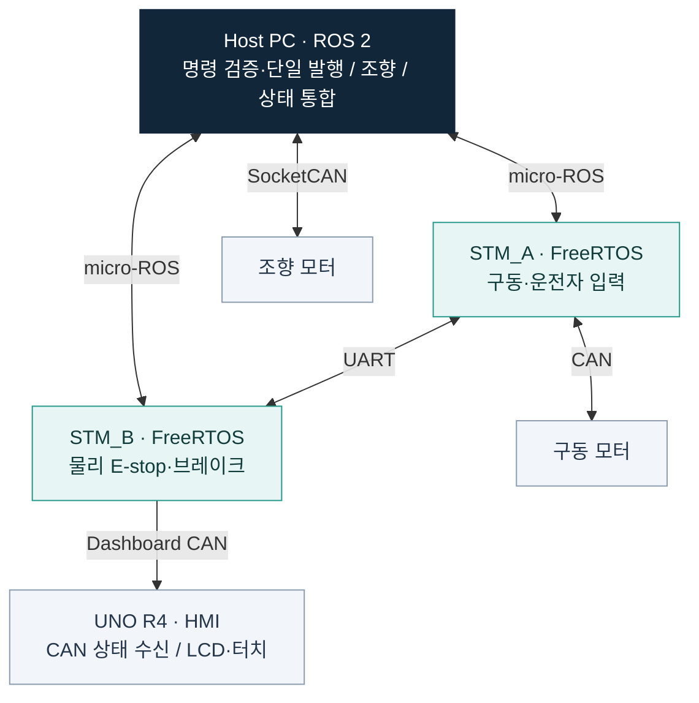

# 신주엽 | Juyeop Shin

건국대학교 전기전자공학부

STM32·ROS 2 기반 차량 제어 소프트웨어와 HIL 시험 환경을 개발했습니다. MuJoCo 기반 보행 위험 탐지 모델 연구와 PSoC Edge E84 배포·검증을 수행했습니다.

[차량 제어][kai-project] · [모델 연구][fastreflex-research] · [엣지 AI 배포][fastreflex-deployment]

## 01. 자율주행 차량의 분산 제어와 검증

**Team K.A.I. · 2025 제어 파트장 / 2026–현재 하드웨어 팀장**

2025년 ROS 2·Arduino Mega 기반 차량 제어 개발을 거쳐, 2026년에는 Host와 두 STM32G474RE에 기능을 분산하는 구조를 설계·개발했습니다. 펌웨어, 장치 간 인터페이스, HIL 시험 환경의 구현과 통합을 맡았습니다. **2026년 테스트위크에서 실차 통합과 상세 검증을 완료했습니다.**

*핵심 제어·통신 경로를 요약한 구성도입니다. HIL에서는 STM_TEST가 차량 입력과 모터의 CAN 응답을 모사하며, 실제 STM_A/B 펌웨어를 사용합니다.*

### 직접 설계·구현한 내용

| 영역 | 구현 내용 | 코드·설계 근거 |
|---|---|---|
| RTOS 펌웨어·통신 | 태스크·우선순위 구성, UART DMA·ring buffer 수신, CRC8·sequence 검사, micro-ROS 재연결 상태 머신 | [STM_A][kai-stma] · [STM_B][kai-stmb] |
| 명령·예외 처리 | 차량 명령 발행 경로 단일화, 시각·최신성·NaN/Inf 검사, 통신 경로별 timeout과 복구 동작 정의 | [명령 게이트][kai-governor] · [안전 동작][kai-safety] |
| 실행 상태 계측 | DWT 기반 태스크 실행시간, activation jitter, deadline miss, stack/heap 여유, E-stop callback→task 지연 관측 | [계측 정의][kai-runtime] · [C 구현][kai-runtime-code] |
| HIL 자동화 | DAC/GPIO 입력·CAN 응답 모사, 브레이크 PWM 관측, 고장 주입 전 정상 통신 확인, YAML 시나리오와 JSON 결과 기록 | [STM_TEST][kai-stmtest] · [HIL 운용·검증][kai-hil] |
| 운용·검증 화면 | 공용 React Console에 Vehicle 관측 전용 경로와 HIL 조작 경로 구성, 진단·통신 상태 표시 | [Console][kai-console] · [검증 기록][kai-console-validation] |
| HMI 분리 | 안전 제어기에서 표시 기능 분리, CAN snapshot 수신, 물리·가상 터치의 화면 전환 로직 공유, C++ 렌더러 재사용 | [UNO R4 HMI][kai-hmi] |

### 확인할 수 있는 검증 기록

- **HIL 기본 시나리오 4종 통과** — `smoke_test`, `estop_test`, `ez_can_timeout`, `keya_can_timeout`. 실제 액추에이터와 분리한 MCU·에뮬레이터 벤치의 2026-09-09 기록입니다. [결과와 시험 범위][kai-hil]
- **고장 주입 시험의 전제조건 개선** — 처음부터 통신이 끊긴 환경을 정상 통과로 오인하지 않도록, fault 주입 전에 해당 경로의 정상 상태를 확인합니다. [시나리오·판정 구조][kai-hil-backend]
- **계측값의 해석 범위 명시** — 태스크 실행시간에는 interrupt·preemption·blocking이 포함됩니다. 관측 최대값과 formal WCET를 구분하고, E-stop 지연의 측정 시작·종료 지점을 문서화했습니다. [계측 기준][kai-runtime]

[프로젝트 전체 코드][kai-project] · [시스템 아키텍처][kai-architecture] · [통신 인터페이스][kai-interfaces]

*Team K.A.I. 공동 프로젝트의 개인 공개 사본입니다. 팀의 공동 작업 이력을 보존하고 있습니다.*

## 02. 보행 위험 탐지 모델 연구

**Infineon FastReflex · Unitree G1 / MuJoCo / PyTorch**

골반 IMU 기반 GRU로 보행 위험을 감지하고, 발바닥 압력 기반 MLP로 지형 정보를 보조 판정합니다. 실행 단위로 학습·검증·평가 데이터를 분리하고, 미래 샘플을 사용하지 않는 전처리와 동결 모델 평가 절차를 구성했습니다.

기존 제한 조건의 baseline은 frozen HOLDOUT에서 Hazard 26/26, no-hazard 26/26, premature 0을 기록했습니다. **새로운 물리 조건으로의 일반화는 아직 입증되지 않았습니다.** 실험의 성공·실패와 중단 근거를 함께 기록합니다.

[연구 코드·현재 결과][fastreflex-research] · [데이터 계약][fastreflex-dataset] · [실험 프로토콜][fastreflex-experiments]

## 03. 엣지 AI 배포·검증

**Infineon FastReflex E84 · PSoC Edge E84 / Cortex-M55 / Ethos-U55**

동결한 연구 모델을 TFLite·INT8·Vela 경로로 변환하고, ModusToolbox에서 CM33 부팅 경로와 CM55/U55 추론 펌웨어를 통합했습니다. C 전처리와 모델 입출력 계약을 구현하고, Python HIL로 Host와 보드의 결과를 단계별로 대조했습니다.

**연구 모델·계약 → TFLite / INT8 → Vela → C 펌웨어 → E84 실보드 → HIL 검증**

- **모델 인계와 재현성:** 센서·특징 순서, 정규화, 입출력 형상, 판정 조건을 manifest와 checksum으로 추적합니다. [모델 계약][fastreflex-contract]
- **실보드 검증:** CRC32·sequence·샘플 식별자를 포함한 UART 프로토콜로 원시 센서·특징·모델 입력창을 각각 재생해 문제 발생 단계를 좁힙니다. [HIL][fastreflex-hil] · [프로토콜 C 코드][fastreflex-protocol]
- **타이밍 분석:** DWT 기반 보드 처리시간과 Host 응답 지연을 분리해, 추론과 통신 병목을 구분합니다. [Runtime 검증][fastreflex-validation]

2026-09-08 **Hazard + Terrain U55 통합 이미지**의 저장된 시험 기록:

| 확인 항목 | 결과 |
|---|---|
| 혼합 replay | Hazard 원시 샘플 140개 + Terrain 입력창 108개 처리 통과 |
| Terrain 보드–Host INT8 비교 | 108개 입력창의 클래스 일치, 최대 확률 오차 `5.96e-8` |
| 보드 요청별 처리시간 p95 | Hazard `877 µs` / Terrain `409 µs` |
| MuJoCo–E84 live 연동 | Ice·Sand 각 8,000샘플 검증, 해당 run의 board deadline miss 0 |

위 시간은 각 요청의 **보드 처리시간**이며 통신을 포함한 전체 응답시간이 아닙니다. Live 검증은 약 0.22–0.23배속 시뮬레이션에서 수행했습니다. Hazard의 엄격한 수치 정합성과 1 kHz 무손실 통신은 남은 과제이며, 현재 결과는 **비출시 엔지니어링 프로토타입** 범위입니다. [측정 조건·결과 원문][fastreflex-dual-validation]

[배포 코드][fastreflex-deployment] · [펌웨어 통합][fastreflex-firmware] · [배포 파이프라인][fastreflex-pipeline]

## 경험

| 기간 | 경험 |
|---|---|
| 2026.06–현재 | **(주)딥이티 기술개발 인턴** — 온디바이스 AI 모델 연구 및 임베디드 배포 검증, Infineon Startup Challenge 2026 프로젝트 참여 |
| 2026–현재 | **Team K.A.I. 하드웨어 팀장** — 분산 제어 구조 설계, 펌웨어·Host 통합 및 실차 검증 |
| 2025 | **Team K.A.I. 제어 파트장** — ROS 2·Arduino Mega·CAN 기반 1/2 규모 자율주행차 제어 개발 |

## 사용 기술

| 분야 | 프로젝트에서 사용한 기술 |
|---|---|
| 펌웨어 | C · C++ · STM32G4 · FreeRTOS · CAN · UART · SPI · I2C |
| 시스템 통합·검증 | ROS 2 Humble · micro-ROS · SocketCAN · HIL · Python · Linux · Git |
| 엣지 AI | PyTorch · MuJoCo · TensorFlow Lite · INT8 · Vela · PSoC Edge E84 · Ethos-U55 · ModusToolbox |
| 도구·웹 UI | React · TypeScript · Vite · Supabase |

## 함께 쓰는 작은 서비스

친구들과 일상에서 사용하는 웹앱도 개발합니다.

- **[ohnochoo][ohnochoo]** — 음악 추천·투표·평점 공유. React·TypeScript·Supabase Realtime·PWA·Web Push.
- **[whomadethis][whomadethis]** — 방문한 음식점의 지도·후기·사진 공유. React·TypeScript·NAVER Maps·Supabase.

---

[GitHub · @shinjuyeop](https://github.com/shinjuyeop)

<!--
유지보수: 2026-09-14 작성.
기술 내용과 수치는 공개 저장소의 코드·설계 문서·저장된 검증 보고서를 대조했다.
Control 756aa5442d0b327f3be6dd59b9b2cc3889b2341c
Infineon_FastReflex 434a40762ffb06991537dff6f97ebe5bb2c5f0fe
Infineon_FastReflex_E84 c1584227cf58234fa9b3f18d56a257db662ed018
역할·인턴은 본인이 작성한 경력 기록 기준이다.
2026년 실차 상세 검증 완료는 2026-09-14 본인 확인을 반영했다.
이 프로필 편집 과정에서는 보드·실차 시험을 새로 수행하지 않았다.
사진·시연 추가 위치와 필요한 자료는 MEDIA_GUIDE.md 참고.
-->

[kai-project]: https://github.com/shinjuyeop/Control
[kai-architecture]: https://github.com/shinjuyeop/Control/blob/main/docs/ARCHITECTURE.md
[kai-interfaces]: https://github.com/shinjuyeop/Control/blob/main/docs/INTERFACES.md
[kai-stma]: https://github.com/shinjuyeop/Control/blob/main/firmware/STM_A/README.md
[kai-stmb]: https://github.com/shinjuyeop/Control/blob/main/firmware/STM_B/README.md
[kai-governor]: https://github.com/shinjuyeop/Control/blob/main/software/src/command_governor/README.md
[kai-safety]: https://github.com/shinjuyeop/Control/blob/main/docs/SAFETY.md
[kai-runtime]: https://github.com/shinjuyeop/Control/blob/main/firmware/common/README.md
[kai-runtime-code]: https://github.com/shinjuyeop/Control/blob/main/firmware/common/runtime_metrics.c
[kai-stmtest]: https://github.com/shinjuyeop/Control/blob/main/firmware/STM_TEST/README.md
[kai-hil]: https://github.com/shinjuyeop/Control/blob/main/docs/HIL_RUNBOOK.md#15-진행-상태와-남은-작업
[kai-hil-backend]: https://github.com/shinjuyeop/Control/blob/main/software/src/vehicle_console/HIL_BACKEND.md
[kai-console]: https://github.com/shinjuyeop/Control/blob/main/software/src/vehicle_console/README.md
[kai-console-validation]: https://github.com/shinjuyeop/Control/blob/main/software/src/vehicle_console/CONSOLE_VALIDATION.md
[kai-hmi]: https://github.com/shinjuyeop/Control/blob/main/firmware/UNO_R4_DASHBOARD/README.md
[fastreflex-research]: https://github.com/shinjuyeop/Infineon_FastReflex
[fastreflex-deployment]: https://github.com/shinjuyeop/Infineon_FastReflex_E84
[fastreflex-contract]: https://github.com/shinjuyeop/Infineon_FastReflex_E84/blob/main/docs/model_contract.md
[fastreflex-hil]: https://github.com/shinjuyeop/Infineon_FastReflex_E84/blob/main/hil/README.md
[fastreflex-protocol]: https://github.com/shinjuyeop/Infineon_FastReflex_E84/blob/main/firmware/fastreflex_e84/proj_cm55/fastreflex_protocol.c
[fastreflex-validation]: https://github.com/shinjuyeop/Infineon_FastReflex_E84/blob/main/reports/e84_hil_runtime_validation.md
[fastreflex-dual-validation]: https://github.com/shinjuyeop/Infineon_FastReflex_E84/blob/main/reports/20260908_terrain_dual_u55.md
[fastreflex-firmware]: https://github.com/shinjuyeop/Infineon_FastReflex_E84/blob/main/reports/e84_firmware_integration.md
[fastreflex-pipeline]: https://github.com/shinjuyeop/Infineon_FastReflex_E84/blob/main/docs/deployment_pipeline.md
[fastreflex-dataset]: https://github.com/shinjuyeop/Infineon_FastReflex/blob/main/docs/dataset.md
[fastreflex-experiments]: https://github.com/shinjuyeop/Infineon_FastReflex/blob/main/docs/experiment_protocol.md
[ohnochoo]: https://github.com/shinjuyeop/ohnochoo
[whomadethis]: https://github.com/shinjuyeop/whomadethis
